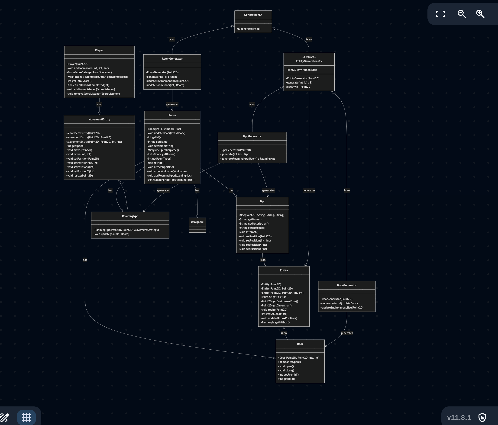
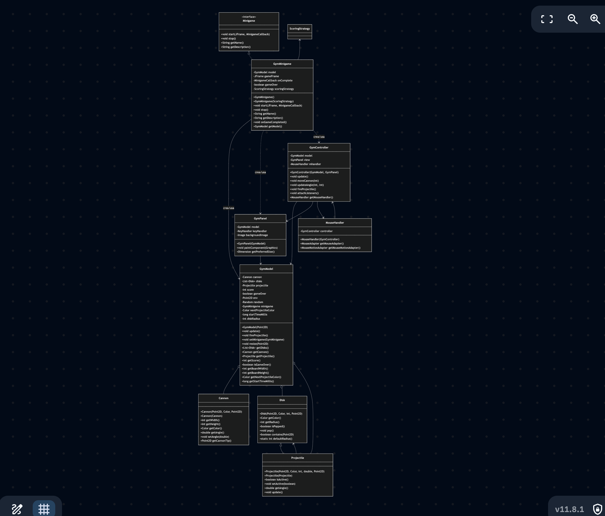
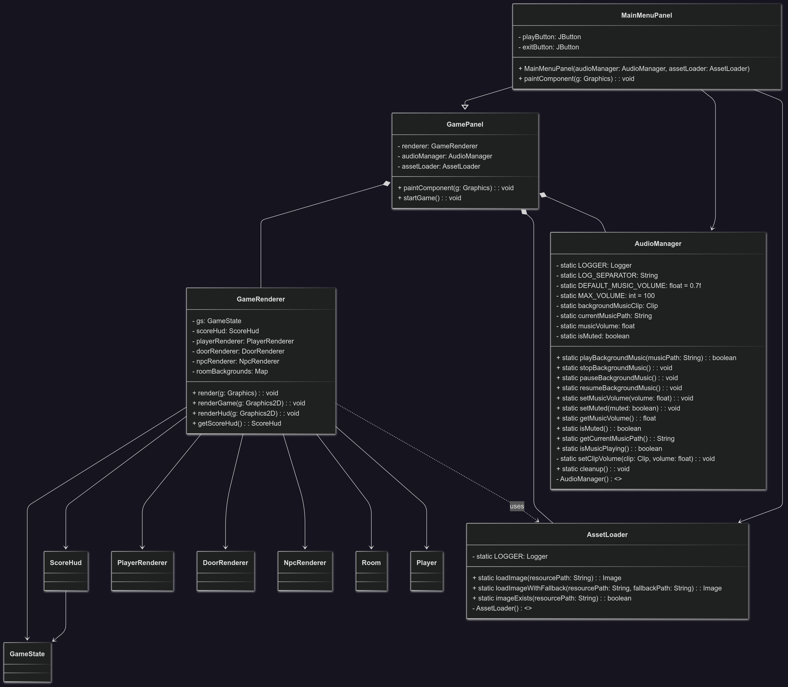
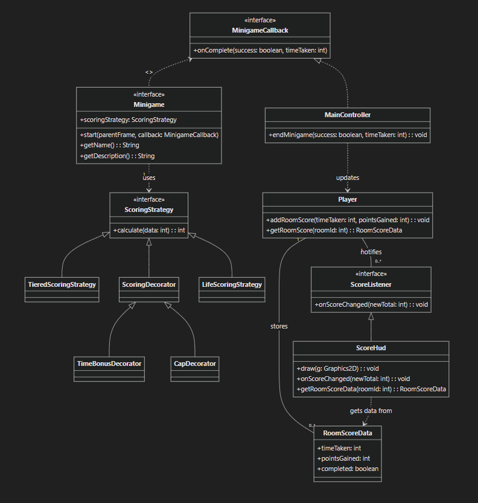
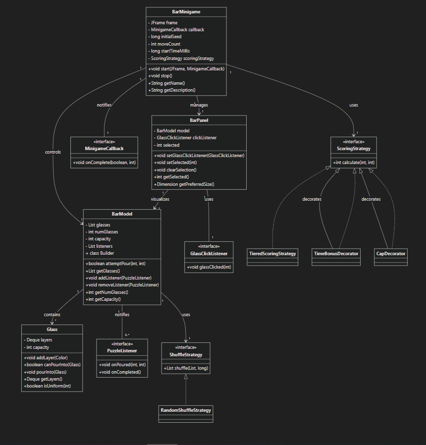
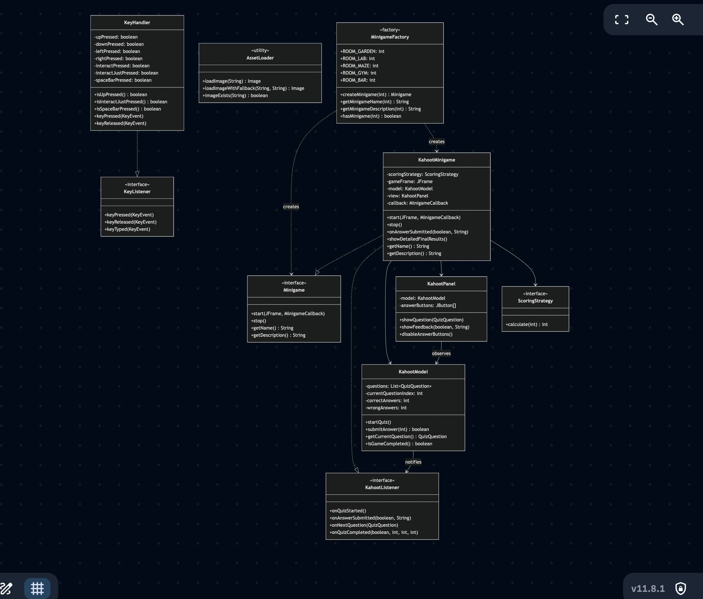

# University Escape

**Pozzati Mattia**, 
**Amantini Davide**, 
**Horna Daniel Alejandro**, 
**Brunelli Simone**, 
**Nori Tommaso**
**Data**: 12 giugno 2025

---

## Indice

1. [Analisi](#analisi)
    1. [Requisiti](#requisiti)
    2. [Analisi e modello del dominio](#analisi-e-modello-del-dominio)
2. [Design](#design)
    1. [Architettura](#architettura)
    2. [Design dettagliato](#design-dettagliato)
        1. [Pozzati Mattia](#pozzati-mattia)
        2. [Amantini Davide](#amantini-davide)
        3. [Horna Daniel Alejandro](#horna-daniel-alejandro)
        4. [Brunelli Simone](#brunelli-simone)
        5. [Nori Tommaso](#nori-tommaso)
3. [Sviluppo](#sviluppo)
    1. [Testing automatizzato](#testing-automatizzato)
    2. [Metodologia di lavoro](#metodologia-di-lavoro)
    3. [Note di sviluppo](#note-di-sviluppo)
4. [Commenti finali](#commenti-finali)
    1. [Autovalutazione e lavori futuri](#autovalutazione-e-lavori-futuri)
A. [Guida Utente](#guida-utente)

---

## 1. Analisi

### 1.1 Requisiti

Il progetto, commissionato dall’Università di Bologna, ha come obiettivo la realizzazione di un videogioco in stile escape room ambientato in un’università. Il gioco appartiene al genere puzzle/adventure e prevede la risoluzione di minigiochi per progredire tra le stanze.

**Requisiti funzionali:**
- Il gioco gestisce una partita composta da più stanze, ognuna con un minigioco diverso (Bar, Gym, Kahoot, ...).
- Presenza di un menu iniziale per avviare la partita, visualizzare la legenda dei tasti e uscire.
- Il giocatore può muoversi tra le stanze, interagire con oggetti e risolvere enigmi.
- Implementazione di collisioni tra entità e oggetti ambientali.
- Gestione delle condizioni di vittoria e sconfitta.

**Requisiti non funzionali:**
- Grafica coerente e pulita, ispirata allo stile pixel art.
- Interfaccia semplice e intuitiva.
- Ottimizzazione delle prestazioni e fluidità di gioco.

### 1.2 Analisi e modello del dominio

Il gioco è composto da una serie di stanze (room), ognuna con un minigioco specifico. Il giocatore deve risolvere i minigiochi per progredire. Il dominio comprende entità come Player, Npc, Door, Room, Minigame.

**Obiettivo:**  
Raggiungere l’uscita finale dell’università risolvendo tutti i minigiochi e superando gli ostacoli.

---

## 2. Design

### 2.1 Architettura


La codebase adotta il pattern architetturale **MVC (Model-View-Controller)** per separare la logica di gioco, la gestione degli input e la visualizzazione grafica.

- **Model:** Gestisce la logica e i dati del gioco (stanze, entità, minigiochi, punteggi). Si trova in `src/main/java/it/unibo/exam/model/`.
- **View:** Si occupa della grafica e dell’interfaccia utente. Si trova in `src/main/java/it/unibo/exam/view/`.
- **Controller:** Media tra model e view, gestendo input e aggiornamenti. Si trova in `src/main/java/it/unibo/exam/controller/`.

Per la logica delle entità, è stato utilizzato il pattern **ECS (Entity-Component-System)**, che permette di comporre comportamenti tramite componenti riutilizzabili.

### 2.2 Design dettagliato

#### 2.2.1 Pozzati Mattia

**Gestione della creazione delle entità:**

Ho implementato il **Factory Pattern** per centralizzare la creazione delle entità di gioco (giocatore, NPC, oggetti interattivi). Questo approccio permette di gestire facilmente la complessità e la varietà delle entità, garantendo coerenza e riusabilità del codice. Le entità sono composte seguendo il paradigma ECS (Entity-Component-System). Le collisioni sono gestite tramite hitbox e metodi dedicati, assicurando un'interazione precisa tra le entità e l'ambiente. Queste sono le entità globali. In ogni minigioco sono presenti Entità caratteristiche sviluppate estendendo quelle globali.

**Minigioco stanza Gym "Bubble Shooter":**



Mi sono occupato della progettazione e dello sviluppo del minigioco della stanza Gym, ispirato al classico "Bubble Shooter". Ho realizzato sia la logica di gioco (model) che la gestione degli input e la visualizzazione grafica (controller e view).

**Implementazione del pattern MVC:**

**Model (GymModel):**
- Gestisce lo stato del gioco: cannon, dischi, proiettili, punteggio
- Implementa la logica di collisione tra proiettili e dischi
- Gestisce la creazione e rimozione dei dischi
- Calcola il punteggio e le condizioni di vittoria
- Metodi principali: `update()`, `fireProjectile()`, `checkForMatches()`, `resize()`

**View (GymPanel):**
- Si occupa del rendering grafico del minigioco
- Gestisce l'input da tastiera (movimento cannon, sparo)
- Aggiorna la visualizzazione a 60 FPS tramite Timer
- Disegna dischi, cannon, proiettili, punteggio e prossimo colore
- Metodi principali: `paintComponent()`, gestione KeyHandler

**Controller (GymController):**
- Media tra model e view
- Gestisce l'input da mouse (angolo di sparo)
- Coordina gli aggiornamenti del model
- Attacca i listener per mouse e tastiera
- Metodi principali: `updateAngle()`, `fireProjectile()`, `attachListeners()`

**Gestione degli input:**
- **MouseHandler**: Gestisce click per sparare e movimento per orientare il cannon
- **KeyHandler**: Gestisce input da tastiera per movimento cannon e sparo

**Logica di gioco implementata:**
- Sistema di collisioni tra proiettili e dischi
- Algoritmo di ricerca cluster per eliminare gruppi di dischi dello stesso colore
- Sistema di punteggio con bonus per velocità
- Gestione del resize della finestra con riposizionamento automatico
- Condizioni di vittoria (eliminare 50 dischi) e sconfitta (dischi troppo in basso)

**Classi principali sviluppate:**
- **Cannon**: Rappresenta il cannon controllato dal giocatore con rotazione e sparo
- **Disk**: Rappresenta i dischi target con colori e stato (popped/attivo)
- **Projectile**: Estende Disk per i proiettili sparati dal cannon
- **GymMinigame**: Implementa l'interfaccia Minigame e coordina MVC

**Altre responsabilità:**
Ho contribuito all'implementazione delle classi relative all'accesso alle risorse del progetto.
Ho partecipato alla progettazione delle interfacce principali, alla definizione delle entità del dominio e alla scrittura dei test.

**Approfondimento tecnico**

* **Gestione delle collisioni e movimento entità**

  La gestione delle collisioni tra entità e oggetti ambientali è stata implementata tramite un sistema di hitbox rettangolari. Ogni entità che può interagire con l’ambiente implementa un metodo `getHitbox()` che restituisce un oggetto `Rectangle` rappresentante la sua area di collisione. Il ciclo di gioco, ad ogni aggiornamento (`update()`), verifica le intersezioni tra le hitbox delle entità mobili (giocatore, NPC) e quelle degli oggetti statici (muri, porte, ostacoli). Se viene rilevata una collisione, il movimento viene annullato o corretto per evitare sovrapposizioni, garantendo così un’interazione realistica e fluida.

* **Algoritmo di ricerca cluster nel minigioco Gym**

  Per l’eliminazione dei gruppi di dischi dello stesso colore (“cluster”), viene utilizzato un algoritmo di ricerca in ampiezza (BFS). Quando un proiettile colpisce un disco, il sistema esplora ricorsivamente tutti i dischi adiacenti dello stesso colore, marcandoli come parte del cluster. Se il cluster raggiunge una dimensione minima (ad esempio 3 dischi), tutti i dischi coinvolti vengono rimossi e il punteggio viene aggiornato di conseguenza. Questo approccio garantisce performance costanti anche con un elevato numero di dischi e permette di gestire facilmente bonus e combo.

* **Gestione del resize e adattamento dinamico**

  Il minigioco Gym supporta il ridimensionamento dinamico della finestra. Tutte le coordinate e le dimensioni degli oggetti vengono calcolate in modo proporzionale rispetto alla dimensione attuale del pannello (`GymPanel`). In caso di resize, viene invocato il metodo `resize()` che ricalcola le posizioni di cannon, dischi e proiettili, mantenendo la coerenza visiva e la giocabilità su qualsiasi risoluzione.

* **Motivazioni delle scelte architetturali**

  L’adozione del pattern ECS per le entità permette di aggiungere o modificare comportamenti (ad esempio movimento, collisione, interazione) in modo modulare, senza dover modificare le classi principali. Il Factory Pattern centralizza la creazione delle entità, facilitando l’estensione del gioco con nuovi tipi di oggetti o NPC. L’architettura MVC, infine, separa nettamente la logica di gioco dalla presentazione grafica e dalla gestione degli input, rendendo il codice più manutenibile e testabile.

* **Esempio di interazione tra Model, View e Controller (Gym)**

  Quando il giocatore preme la barra spaziatrice, il `KeyHandler` notifica il `GymController`, che a sua volta invoca il metodo `fireProjectile()` sul `GymModel`. Il modello aggiorna lo stato del gioco (aggiungendo un nuovo proiettile), notifica la view (`GymPanel`) che si occupa di ridisegnare la scena, mostrando il proiettile in movimento. Questo flusso garantisce una separazione chiara delle responsabilità e una risposta immediata agli input dell’utente.

---

#### 2.2.2 Amantini Davide

**Gestione del Menu Principale e delle Opzioni**



Ho progettato e sviluppato la **GUI del menu principale** utilizzando Swing, seguendo le best practice dell'architettura **MVC** e tenendo conto della futura integrazione di minigiochi e opzioni di gioco.

* **Componenti principali**:
  * **MainMenuPanel**: pannello principale con i pulsanti "Gioca", "Opzioni" e "Esci", sfondo personalizzato e label esplicativa dei comandi principali (WASD, E, ESC).
  * **Integrazione responsive**: il layout è realizzato tramite GridBagLayout per adattarsi a qualsiasi dimensione finestra, e la grafica è caricata tramite l'utility `AssetLoader` per una gestione centralizzata delle risorse.

* **Gestione Eventi**:
  * Ogni bottone è associato a un'azione ben distinta tramite listener lambda, che comunica con il controller per avviare il gioco, mostrare il dialog delle opzioni, o uscire dal programma.
  * Il tasto **ESC** è intercettato tramite l'ActionMap/InputMap del pannello di gioco, permettendo di aprire un **menu di pausa** da cui si può tornare al menu principale o regolare le opzioni audio senza perdere lo stato corrente.

* **Gestione delle Opzioni (Audio/Musica)**:
  * La finestra **Opzioni** permette di modificare in tempo reale il volume della musica di sottofondo tramite uno **slider** (JSlider) e di attivare/disattivare l'audio generale tramite un pulsante mute.
  * Il **salvataggio delle preferenze** avviene in modo persistente usando le Preferences di Java (se necessario si può estendere con serialization o salvataggio file JSON/XML).

* **Comandi Principali**: sotto ai pulsanti del menu viene visualizzata una label HTML stilizzata che evidenzia i tasti di movimento e interazione, per una user experience chiara anche a nuovi giocatori.

**Minigioco CatchBall - Architettura e Sviluppo**


Ho progettato e realizzato il **minigioco CatchBall** (MVC pattern), ambientato nella stanza Garden, che simula la raccolta di gocce d'acqua con una borraccia.

* **Architettura MVC**:
  * **Model** (`CatchBallModel`): mantiene lo stato del gioco (posizione e vite, gestione palline, logica di vittoria/sconfitta, generazione random delle gocce).
  * **View** (`CatchBallPanel`): si occupa del rendering della scena, usando immagini custom per la bottiglia e le gocce. Il rendering è double-buffered e ottimizzato per evitare flicker.
  * **Controller** (`CatchBallMinigame`): gestisce input tastiera (A/D per movimento), timer per aggiornare la partita e sincronizza model e view; aggiorna la logica di punteggio con una strategia a decoratori (es. bonus tempo, cap massimo punti).

* **Gestione delle risorse**:
  * Tutte le immagini (sfondo, bottiglia, goccia) sono caricate centralmente con `AssetLoader` e ridimensionate dove necessario, garantendo efficienza e riuso.
  * Uso di fallback: se un'immagine non viene trovata, si passa automaticamente a un disegno placeholder.

* **Salvataggio delle Preferenze**:
  * Le preferenze audio e volume vengono lette/salvate ogni volta che si apre il dialog opzioni o il menu di pausa, usando `AudioManager` e, dove necessario, le Preferences di Java.

* **Comunicazione tra componenti**:
  * Il minigioco notifica il controller principale tramite callback (`MinigameCallback`), passando esito e punteggio. Questo permette di aggiornare la schermata HUD e i punteggi globali.

* **User Experience**:
  * Ogni aspetto grafico e di input è pensato per garantire immediatezza, chiarezza e coerenza con lo stile del resto del gioco (font, colori, trasparenze, icone, feedback visivi).
  * L'utente può sempre tornare al menu principale tramite ESC, senza rischiare di perdere i progressi o le impostazioni scelte.

**Altre Responsabilità e Contributi**

* Ho contribuito alla gestione centralizzata dell'audio di gioco (`AudioManager`).
* Ho collaborato nella definizione degli standard di stile (colori, font, layout) per assicurare coerenza visiva tra menu, minigiochi e HUD.
* Mi sono occupato della progettazione delle interfacce principali e della definizione delle principali entità di dominio.

---

#### 2.2.3 Horna Daniel Alejandro

**Sistema di Punteggio e della Logica di Scoring**

Il sistema di punteggio nel nostro gioco è stato progettato utilizzando **design patterns** per garantire un'architettura robusta, estensibile e facilmente manutenibile. I **design patterns** utilizzati sono fondamentali per la flessibilità del sistema, che permette di modificare facilmente il comportamento del calcolo del punteggio, aggiungere nuovi bonus o penalità, e aggiornare automaticamente l'interfaccia utente.

Inoltre, il sistema è stato progettato per **rispettare il pattern MVC (Model-View-Controller)**, separando chiaramente la logica del gioco (Model), la logica di visualizzazione (View) e il flusso di controllo (Controller).

**I Pattern Utilizzati**

Il sistema di punteggio e scoring si basa su tre design patterns principali: **Strategy**, **Decorator** e **Observer**. Ogni pattern gioca un ruolo specifico nell'architettura, garantendo la separazione delle preoccupazioni e la facilità di estensione.

* **1) Strategy Pattern**

  * **Cos'è**:
    Il pattern **Strategy** è stato utilizzato per definire una **famiglia di algoritmi** di calcolo del punteggio, che possono essere intercambiati senza modificare il codice cliente.
    La base del sistema di calcolo dei punteggi è l'interfaccia `ScoringStrategy` che definisce il metodo `calculate(int data)`. Ogni implementazione concreta della strategia definisce come il punteggio deve essere calcolato.

  * **Come è stato utilizzato**:
    * **`TieredScoringStrategy`**: assegna un punteggio in base al tempo impiegato dal giocatore per completare il minigioco, suddividendo il punteggio in fasce di tempo (veloce, medio, lento).
    * **Vantaggio**: ogni minigioco può utilizzare una diversa strategia di calcolo dei punteggi senza modificare il codice del controller, garantendo che il sistema sia facilmente estendibile.

  * **Beneficio**:
    * Consente di cambiare facilmente il comportamento del calcolo dei punti, aggiungere nuove regole di scoring o modificare il metodo di calcolo per ogni minigioco.
    * Ad esempio, se si volesse introdurre una modalità difficile con un diverso calcolo del punteggio, basterebbe scrivere una nuova strategia senza toccare il codice che gestisce i minigiochi o la visualizzazione del punteggio.

---

* **2) Decorator Pattern**

  * **Cos'è**:
    Il pattern **Decorator** è stato utilizzato per aggiungere comportamento aggiuntivo alla strategia di punteggio, come **bonus per velocità** o **limiti massimi di punti**. Il decoratore permette di "avvolgere" una strategia esistente, aggiungendo nuovi comportamenti senza modificare la strategia originale.

  * **Come è stato utilizzato**:
    * **`TimeBonusDecorator`**: aggiunge un bonus di punti se il minigioco è completato in un tempo inferiore a una certa soglia (ad esempio, sotto i 15 secondi).
    * **`CapDecorator`**: impone un limite massimo ai punti che un giocatore può guadagnare in una stanza, evitando che il punteggio cresca oltre un valore predefinito (es. 120 punti).

  * **Beneficio**:
    * Consente di combinare facilmente diversi comportamenti di punteggio.
    * In questo modo, un punteggio può essere modificato dinamicamente, aggiungendo bonus o capi senza cambiare il comportamento di calcolo base.
    * La catena di decoratori può essere modificata o estesa a runtime, il che rende il sistema di punteggio altamente configurabile.

---

* **3) Observer Pattern**

  * **Cos'è**:
    Il pattern **Observer** è stato utilizzato per implementare l'aggiornamento automatico dell'interfaccia utente quando il punteggio cambia. La classe `ScoreHud` (l'Observer) ascolta i cambiamenti nel punteggio del `Player` (il Subject) e si aggiorna automaticamente senza la necessità di invocazioni manuali.

  * **Come è stato utilizzato**:
    * La classe `Player` implementa l'interfaccia `ScoreListener` e notifica gli osservatori ogni volta che il punteggio cambia tramite il metodo `addRoomScore(...)`.
    * **`ScoreHud`** è registrato come listener, e ogni volta che il punteggio cambia, l'interfaccia viene aggiornata per riflettere il nuovo punteggio.

  * **Beneficio**:
    * Decouple la logica di aggiornamento dell'interfaccia utente dalla logica di calcolo del punteggio.
    * Il codice del controller non ha bisogno di preoccuparsi di aggiornare la UI ogni volta che cambia il punteggio; è sufficiente che il modello (il `Player`) notifichi gli ascoltatori (come `ScoreHud`), che si occupano di eseguire l'aggiornamento.

---

* **Creazione di `RoomScoreData` (o `RoomPlayerData`)**

  Per migliorare la tracciabilità e la gestione del punteggio per ogni stanza completata, abbiamo introdotto una nuova classe chiamata **`RoomScoreData`** (o **`RoomPlayerData`**):

  * **Perché è stata creata**:
    Ogni volta che un giocatore completa una stanza, bisogna registrare il punteggio per quella stanza, il tempo impiegato e lo stato di completamento. **`RoomScoreData`** tiene traccia di questi dati specifici per ogni stanza.

  * **Cosa fa**:
    La classe `RoomScoreData` memorizza:
    * **`timeTaken`**: il tempo impiegato per completarla
    * **`pointsGained`**: i punti guadagnati
    * **`completed`**: se la stanza è stata completata con successo

  * **Dove viene utilizzata**:
    Ogni volta che un minigioco viene completato, la classe `Player` registra un nuovo oggetto `RoomScoreData` per la stanza. L'oggetto `RoomScoreData` viene poi usato per calcolare il punteggio totale e notificare gli ascoltatori (ad esempio l'HUD).

  **Esempio di utilizzo:**

  Quando il giocatore completa un minigioco, il sistema registra automaticamente i dati di punteggio per quella stanza specifica. Il metodo `addRoomScore` aggiunge i dati alla mappa interna del giocatore utilizzando l'ID della stanza come chiave, memorizzando il tempo impiegato e i punti guadagnati per un accesso futuro e per il calcolo del punteggio totale.

  In questo caso, **`addRoomScore(...)`** aggiunge i dati alla mappa `roomScores` del `Player` con l'ID della stanza come chiave. L'oggetto `RoomScoreData` contiene le informazioni sui punti guadagnati e il tempo impiegato per completare la stanza.

---

* **Utilizzo nei Minigiochi**

Ogni **minigioco** è legato al sistema di punteggio tramite la seguente interazione:

* **1. Chiamata al metodo di completamento minigioco**
  Quando un minigioco termina, viene invocato il callback con il risultato (successo o fallimento) per notificare il sistema principale dell'esito della partita.

* **2. Calcolo dei Punti**
  Il sistema di scoring calcola automaticamente i punti da assegnare basandosi sui parametri configurati (tempo impiegato, penalità, bonus) utilizzando la strategia di punteggio associata al minigioco.

* **3. Aggiornamento del Punteggio**
  I punti calcolati vengono registrati nel profilo del giocatore insieme al tempo impiegato, aggiornando il punteggio totale e notificando tutti i listener registrati per l'aggiornamento dell'interfaccia utente.

* **4. Aggiornamento dell'HUD**
  La classe `ScoreHud` osserva il punteggio del giocatore e si aggiorna automaticamente ogni volta che cambia, grazie al **Pattern Observer**.



---

**Bar Minigame**

La realizzazione del **Bar Minigame** ("Sort & Serve") ha seguito un approccio didattico e rigoroso all'**Object-Oriented Programming** (OOP), basandosi su pattern solidi per ottenere modularità, estensibilità e una chiara separazione dei ruoli tra componenti.

Il minigioco sfrutta in modo massiccio i pattern **MVC (Model-View-Controller)**, **Observer**, **Builder**, **Strategy** e **Decorator**. Ogni parte del progetto è stata progettata per isolare responsabilità e facilitare la collaborazione di più sviluppatori.

---

* **1 Model-View-Controller (MVC)**

  * **Model:**

    * **`BarModel`**: Tiene lo stato della partita (glasses, mosse, listeners, regole di gioco) e gestisce la logica di tutte le azioni possibili.
    * **`Glass`**: Rappresenta un singolo bicchiere (con capacità e pila di colori), incluse le regole per i versamenti e i controlli di validità.
  * **View:**

    * **`BarPanel`**: Pannello custom di Swing che disegna i bicchieri, le selezioni, i livelli di liquido e lo sfondo. Gestisce click utente e segnala le azioni. Qui si registra anche il **listener** di input dell'utente, **`GlassClickListener`**.
  * **Controller:**

    * **`BarMinigame`**: Il "cervello" del minigioco: gestisce la partenza, lo stato di gioco, la logica di restart, la ricezione di eventi dal modello, il punteggio e il callback di fine minigioco.

  **Vantaggio:**
  Questa separazione permette di modificare l'aspetto grafico, la logica o le interazioni utente senza dover toccare tutte le classi.

---

* **2) Observer Pattern**

  * **Cosa fa:**
    Il modello (`BarModel`) notifica tutti i listener ogni volta che cambia (es. avviene un versamento o si completa il puzzle).

  * **File/Interfacce Coinvolte:**

    * `PuzzleListener` (interfaccia): definisce i metodi `onPoured` e `onCompleted`.
    * Il `BarPanel` si aggiorna con repaint ogni volta che riceve una notifica; il `BarMinigame` può chiudere la finestra o segnalare la fine del minigioco tramite callback.
    * **`GlassClickListener` (view → controller):** listener specifico che collega il click di un bicchiere all'azione (versamento) da gestire.

  * **Esempio:**

    Il modello registra un listener che reagisce agli eventi di versamento e completamento. Quando avviene un versamento, la view viene aggiornata per riflettere i cambiamenti. Quando il puzzle è completato, viene invocato il callback per notificare il sistema principale e chiudere il minigioco.

  **Vantaggio:**
  Disaccoppiamento tra input utente, logica di gioco e logica di rendering. Qualunque nuova interazione (ad es. drag\&drop, tastiera, ecc.) si può gestire aggiungendo o cambiando un listener, senza modificare la struttura base.

---

* **3) Builder Pattern**

  * **Cosa fa:**
    Semplifica la costruzione di oggetti complessi con molti parametri, tramite una DSL fluida.

  * **File Coinvolto:**

    * `BarModel.Builder`: consente di creare modelli configurabili (numero bicchieri, capacità, colori, seed, strategia di shuffle…).

  * **Esempio:**

    Il builder permette di configurare il modello del bar minigioco specificando il numero di bicchieri, la loro capacità, i colori disponibili, il seed per la generazione casuale e la strategia di shuffle da utilizzare. Questo approccio rende la creazione del modello flessibile e leggibile.

  **Vantaggio:**
  Codice leggibile, parametri facoltativi, nessuna "costruttore telescopico".

---

* **4) Strategy & Decorator Pattern (Sistema di Punteggio)**

  * **Strategy:**

    * Permette di definire diversi algoritmi di calcolo punteggio e selezionarli a runtime.
    * **File Coinvolti:**

      * `ScoringStrategy` (interfaccia): Metodo `calculate(int timeTaken, int roomId)`.
      * `TieredScoringStrategy`: Strategia base che assegna punti in base al tempo.

  * **Decorator:**

    * Aggiunge comportamento (bonus/limiti) a una strategia senza modificarne il codice.
    * **File Coinvolti:**

      * `TimeBonusDecorator`: Bonus punti se finisci entro una certa soglia di secondi.
      * `CapDecorator`: Impone un tetto massimo ai punti.

  * **Catena d'Uso:**

    Il sistema permette di combinare decoratori per creare strategie di punteggio complesse. Ad esempio, si può applicare un bonus per velocità e poi imporre un limite massimo ai punti, creando una catena di decoratori che modifica il comportamento della strategia base.

  * **Dove viene usato:**

    * Nel controller del minigioco, la strategia viene utilizzata al completamento per calcolare il punteggio finale basandosi sul tempo impiegato e applicando tutti i bonus e limiti configurati.

  **Vantaggio:**
  Sistema di punteggio totalmente configurabile: puoi cambiare strategia, stacking decoratori, o crearne di nuovi senza cambiare nulla in controller, model o view.

---

* **5) Strategy Pattern (ShuffleStrategy & RandomShuffleStrategy)**

  * **Cosa fa:**
    Permette di astrarre la logica di miscelamento iniziale delle bottiglie, consentendo diversi algoritmi di shuffle.

  * **File Coinvolti:**

    * `ShuffleStrategy` (interfaccia): Definisce il metodo `shuffle(List<Color> pool, long seed)`.
    * `RandomShuffleStrategy`: implementa la logica di shuffle casuale.

  * **Dove viene usato:**

    La strategia di shuffle viene configurata durante la creazione del modello, permettendo di specificare l'algoritmo di miscelamento da utilizzare per inizializzare i bicchieri con i colori.

  **Vantaggio:**
  Chiunque può aggiungere nuove modalità di inizializzazione o testare algoritmi diversi di shuffle senza modificare la logica principale del modello o controller.

---

* **6) Flow e Collegamento dei Componenti**

  * **Integrazione con il sistema di gioco:**

    * Il minigioco viene creato tramite la factory dei minigiochi (`MinigameFactory`) e utilizza un callback (`MinigameCallback`) per notificare la fine partita e passare punteggio/tempo al sistema principale.
  * **Restart:**

    * Premendo `R` si ricrea la stessa partita usando lo stesso seed (quindi layout identico, utile per tentativi multipli e fairness).
  * **Logica di scoring:**

    * Il controller tiene traccia delle mosse (`moveCount`) e del tempo, passando tutto al calcolatore di punteggio al termine.
    * Il punteggio è separato dalla UI e dalla logica di gioco, pronto per essere letto dal sistema di progressione, HUD, etc.

  

**Altre responsabilità:**

* Ho creato classi relative agli NPC di spostamento con le loro implementazioni.
* Sono stato il Project Manager e Code Checker per la durata del progetto

---

#### 2.2.4 Brunelli Simone

**KahootMinigame - Quiz Interattivo con Pattern MVC**

La classe `KahootMinigame` implementa il pattern MVC per separare chiaramente la logica, la presentazione e il controllo. L'implementazione si integra con il sistema di scoring esistente del team.

La classe è progettata per accettare una strategia di punteggio come parametro nel costruttore, garantendo la flessibilità e l'integrazione con il sistema di scoring esistente. Il costruttore utilizza una validazione robusta per assicurarsi che la strategia di punteggio non sia null, prevenendo errori a runtime e garantendo la correttezza del comportamento del sistema.

* **Gestione Stati e Threading**

  Implementazione di un workflow per gestire il ciclo vita del quiz:

  Il sistema implementa un workflow asincrono per gestire il ciclo di vita del quiz. Utilizza un thread separato per gestire i ritardi di feedback senza bloccare l'interfaccia utente. Il sistema attende un tempo predefinito prima di mostrare i risultati o la prossima domanda, utilizzando SwingUtilities.invokeLater per garantire che gli aggiornamenti dell'interfaccia avvengano nel thread di Swing. Include anche una gestione robusta delle interruzioni del thread per evitare comportamenti imprevisti.

* **Sistema Penalità Personalizzato**

  Aggiunge 10 secondi per ogni risposta sbagliata:

  Il sistema implementa un meccanismo di penalità personalizzabile che aggiunge un tempo extra per ogni risposta sbagliata. Il metodo calcola il tempo finale sommando il tempo effettivamente impiegato con le penalità accumulate, moltiplicando il numero di risposte errate per un valore di penalità configurabile. Questo approccio incoraggia la precisione e aggiunge un elemento strategico al gameplay.

* **Interfaccia Utente Dinamica**

  * Feedback colorato per risposte corrette/errate
  * Aggiornamento real-time di progresso e statistiche
  * Gestione graceful degli stati di transizione

---

**KeyHandler - Sistema di Input**

* **Filosofia di Design**

  La classe `KeyHandler` fornisce un sistema di input che supporta sia azioni continue (movimento) che discrete (interazioni). L'implementazione risolve il problema classico del "key repeat" per le azioni singole.

* **Innovazioni Tecniche**

  Pattern Auto-Reset per Azioni Singole

  Il sistema implementa un pattern di auto-reset per le azioni singole, risolvendo il classico problema del "key repeat" dove un tasto premuto continuamente potrebbe attivare l'azione più volte. I metodi controllano lo stato del flag e, se attivo, lo resettano immediatamente dopo averlo letto, garantendo che ogni pressione del tasto venga registrata una sola volta. Questo approccio garantisce precisione nelle azioni discrete come interazioni o spari.

* **Sistema Dual-Key Mapping**

  Supporto per tasti primari e alternativi per migliorare l'accessibilità:

  Il sistema supporta sia il layout WASD che le frecce direzionali per migliorare l'accessibilità e l'usabilità. Ogni direzione di movimento può essere controllata da due tasti diversi, permettendo ai giocatori di utilizzare la configurazione più comoda per loro. Questo approccio inclusivo migliora l'esperienza utente e rende il gioco accessibile a un pubblico più ampio.

* **Vantaggi Implementativi**

  * **Efficienza di Polling**: I controller leggono lo stato quando necessario
  * **Coerenza dello Stato**: Prevenzione stati inconsistenti con auto-reset
  * **Esperienza Utente**: Supporto sia WASD che frecce per inclusività
  * **Precisione delle Azioni**: Distinzione netta tra azioni continue e discrete

---

**AssetLoader - Gestione Risorse in Collaborazione**

La classe `AssetLoader` è stata sviluppata in stretta collaborazione con un membro del team, combinando le competenze per creare una classe utility robusta per la gestione delle risorse. Insieme è stato progettato un sistema che enfatizza la robustezza e graceful degradation.

**Soluzioni Tecniche**

* **Sistema Fallback Intelligente**

  Il sistema implementa un meccanismo di fallback intelligente che tenta di caricare un'immagine alternativa quando quella principale non è disponibile. Il metodo prima prova a caricare l'immagine richiesta e, se fallisce, tenta automaticamente di caricare un'immagine di riserva. Questo approccio garantisce la robustezza del sistema e previene crash dell'applicazione quando le risorse non sono disponibili, fornendo anche un logging dettagliato per il debugging.

* **Gestione Completa degli Errori**

  Il sistema implementa una gestione completa degli errori che copre tutti i possibili scenari di fallimento nel caricamento delle immagini. Include controlli per risorse mancanti, errori di lettura del file, e formati di immagine non validi. Ogni tipo di errore viene gestito specificamente con messaggi di log appropriati, permettendo un debugging efficace. Il sistema utilizza try-catch per gestire le eccezioni in modo graceful, evitando crash dell'applicazione e fornendo feedback dettagliato per lo sviluppo.

* **Caratteristiche Collaborative**

  * **Validazione Risorse**: Controllo esistenza sviluppato congiuntamente
  * **Logging Dettagliato**: Sistema di logging progettato insieme per debugging completo
  * **Efficienza di Memoria**: Strategia di caricamento lazy definita in team

---

**MinigameFactory - Implementazione del Factory Pattern**

* **Pattern di Design**

  La classe `MinigameFactory` implementa il Factory Pattern per centralizzare la creazione dei minigame e fornire un'interfaccia uniforme per il sistema.

**Architettura**

* **Mapping Room-to-Minigame**

  Il factory implementa un mapping centralizzato che associa ogni ID di stanza al corrispondente minigioco. Utilizza una struttura switch-case per creare l'istanza appropriata del minigioco in base all'ID della stanza. Include una validazione robusta che lancia un'eccezione con messaggio descrittivo se viene fornito un ID non valido, specificando anche l'intervallo di ID accettabili. Questo approccio centralizzato semplifica la gestione dei minigiochi e garantisce coerenza nella creazione degli oggetti.

* **Metodi di Utilità**
  Metodi per evitare istanziazioni inutili:

  Il factory fornisce metodi di utilità che permettono di ottenere informazioni sui minigiochi senza dover creare istanze degli oggetti. Il metodo per ottenere il nome del minigioco utilizza una struttura switch-case per restituire il nome appropriato in base all'ID della stanza, includendo validazione per ID non validi. Il metodo per verificare l'esistenza di un minigioco controlla semplicemente se l'ID rientra nell'intervallo valido, offrendo un controllo efficiente senza overhead di creazione oggetti.

* **Vantaggi Architetturali**
  * **Creazione Centralizzata**: Unico punto per creazione minigame
  * **Type Safety**: Validazione input con eccezioni descrittive
  * **Estensibilità**: Facile aggiunta nuovi minigame
  * **Accesso alle Informazioni**: Metadati senza istanziazione

---

**Diagramma UML delle Classi**



---

* **Caratteristiche Chiave**

  * **Robustezza**: Gestione completa degli errori con fallback intelligenti
  * **Estensibilità**: Architettura modulare per facilità di espansione
  * **Usabilità**: Interfacce intuitive con supporto accessibilità
  * **Performance**: Gestione efficiente delle risorse e threading ottimizzato
  * **Collaborazione**: Sviluppo in team con integrazione seamless

---

* **Note sull'Implementazione**

  * Implementazione **MVC** con gestione threading avanzata per `KahootMinigame`
  * Sistema **input** con auto-reset per azioni singole in `KeyHandler`
  * Utility **robusta** sviluppata in collaborazione con fallback per `AssetLoader`
  * **Factory** per creazione centralizzata minigame in `MinigameFactory`

---

Absolutely! Here’s your **combined report** in clean Markdown, with the **Endgame Feature** section first, followed by the **Maze Minigame** section. All formatting is unified for pasting into your final document.

---

#### 2.2.5 Tommaso Nori

### Schermata Finale Universale: Architettura e Flusso

Ho progettato e sviluppato la **schermata finale universale** (`EndGameMenu`) che viene visualizzata automaticamente al termine della partita, integrandola con il pannello di gioco principale (`GamePanel`), la gestione della leaderboard e il flusso generale dell’applicazione.

---

### Architettura e Pattern Utilizzati

L’implementazione segue rigorosamente il **pattern MVC (Model-View-Controller)**:

* **Model**

  * `LeaderboardEntry`: rappresenta una voce della classifica con nome, punteggio, tempo e data.
  * `LeaderboardManage`: gestisce tutte le operazioni sulla classifica, compresi caricamento/salvataggio persistente su file, aggiunta di nuovi punteggi e ordinamento delle entry.
* **View**

  * `GamePanel`: pannello principale del gioco, responsabile della visualizzazione dinamica delle stanze, degli HUD di gioco e, al termine della partita, della transizione alla schermata di fine gioco.
  * `EndGameMenu`: pannello Swing che mostra il riepilogo finale dei risultati del giocatore e la leaderboard aggiornata.
* **Controller**

  * `MainController`: coordina il flusso dell’applicazione, verifica le condizioni di vittoria, gestisce la transizione tra i pannelli (`GamePanel` → `EndGameMenu`) e il passaggio dei dati tra le componenti.

---

### Flusso di Attivazione: Dal GamePanel alla Schermata Finale

1. **Completamento del Gioco**

   * All’interno di `GamePanel`, tramite il controller (`MainController`), viene costantemente monitorato lo stato di completamento delle stanze da parte del giocatore.
   * Quando il giocatore completa tutte le stanze, viene invocato il metodo `checkWin()` nel controller:

     ```java
     private void checkWin() {
         if (gameState.getPlayer().allRoomsCompleted(TOTALPUZZLEROOMS)) {
             running = false;
             SwingUtilities.invokeLater(this::showEndGameMenu);
         }
     }
     ```

2. **Transizione dal GamePanel all’EndGameMenu**

   * `showEndGameMenu()` crea una nuova istanza di `EndGameMenu`, passando il frame principale e l’oggetto `Player`.
   * Il `GamePanel` viene sostituito dall’`EndGameMenu` nel frame principale, congelando lo stato di gioco e presentando il riepilogo finale.

3. **Gestione e Visualizzazione della Leaderboard**

   * All’interno di `EndGameMenu`, viene richiesto al giocatore di inserire il proprio nome se il punteggio è tra i migliori dieci (`LeaderboardManage.addScore()`).
   * La leaderboard viene aggiornata in tempo reale e salvata su file per garantire la persistenza tra le sessioni.
   * La schermata finale mostra:

     * Il punteggio totale
     * Il tempo totale
     * La posizione in classifica
     * La top 10 aggiornata
     * Bottoni per tornare al menu principale, riavviare la partita o uscire dal gioco

4. **Ritorno o Restart**

   * Dal pannello `EndGameMenu` l’utente può scegliere di tornare al menu principale, iniziare una nuova partita o chiudere il gioco, con la gestione degli eventi implementata nel controller.

---

### Principali Responsabilità e Vantaggi del Design

* **Separazione dei ruoli:**
  Ogni componente (`GamePanel`, `EndGameMenu`, `LeaderboardManage`) ha responsabilità chiare e ben definite secondo l’MVC, facilitando manutenzione e modifiche future.

* **Transizione fluida:**
  Il passaggio dal gioco attivo alla schermata finale è gestito in modo trasparente per l’utente grazie al controller e al sistema di pannelli Swing.

* **Universalità:**
  La soluzione è pronta per essere estesa con nuove metriche di classifica, diversi tipi di riepilogo, e nuovi flussi di fine gioco senza modificare la logica di base.

* **Persistenza:**
  I dati della classifica vengono salvati su file, garantendo storicizzazione e recupero alla successiva apertura del gioco.

* **Esperienza utente curata:**
  L’utente viene guidato nella visualizzazione del proprio risultato e ha sempre la possibilità di ripartire o uscire, mantenendo sempre la coerenza grafica.

  


---

**Maze Minigame**

La realizzazione del **Maze Minigame** (“Trova l’Uscita”) segue un approccio rigoroso all’**Object-Oriented Programming** (OOP) e sfrutta pattern consolidati per garantire modularità, estendibilità e una netta separazione delle responsabilità.

---

**Pattern Principali Utilizzati**

Il minigioco utilizza in modo strutturato i pattern **MVC (Model-View-Controller)**, **Strategy**, e **Decorator** (per il sistema di punteggio), oltre a una forte separazione delle componenti tramite interfacce e callback.

---

* **1) Model-View-Controller (MVC)**

  * **Model:**

    * **`MazeModel`**

      * Gestisce lo stato corrente della partita: matrice del labirinto, posizione del giocatore, stato di completamento.
      * Valida gli spostamenti e verifica il raggiungimento dell’uscita.
    * **`MazeGenerator`**

      * Si occupa della generazione dinamica dei labirinti tramite un algoritmo di backtracking ricorsivo.
      * Restituisce matrici parametrizzate in base al livello di difficoltà, garantendo almeno un percorso valido.
  * **View:**

    * **`MazePanel`**

      * Pannello Swing custom per il rendering del labirinto, del giocatore, dell’uscita e delle informazioni di stato (timer, livello).
      * Gestisce la ricezione degli input da tastiera e comunica gli eventi di movimento al controller.
  * **Controller:**

    * **`MazeMinigame`**

      * Coordina il flusso del minigioco: avvio livelli, gestione timer, avanzamento tra livelli o reset in caso di fallimento.
      * Riceve gli input dal view, chiama i metodi del model per validare e aggiornare lo stato, aggiorna la view.
      * Segnala la fine del minigioco al sistema principale tramite callback, comunicando successo, tempo e punteggio.

    **Vantaggio:**
    Questa separazione permette di modificare la logica, l’aspetto grafico o le modalità di interazione senza influenzare le altre componenti.

---

* **2) Flow e Collegamento dei Componenti**

* **Integrazione col sistema di gioco:**
  Il minigioco viene istanziato tramite la factory centrale (`MinigameFactory`) e utilizza un callback (`MinigameCallback`) per notificare successo/fallimento e passare tempo e punteggio al sistema principale.
* **Progressione multilivello:**
  Completato ogni labirinto, si avanza al successivo fino al completamento di tutti i livelli.
* **HUD e stato:**
  Il pannello il livello corrente, stato completamento e messaggi di feedback.

  

---

## 3. Sviluppo

### 3.1 Testing automatizzato

Abbiamo implementato una **suite completa di test automatizzati** utilizzando **JUnit 5**, coprendo tutti i componenti principali del sistema e garantendo la qualità del codice attraverso controlli automatizzati.

### Test dei Minigiochi

**BarMinigameTest:**
- Verifica inizializzazione corretta del minigioco
- Test del sistema start/stop senza errori
- Validazione integrazione con sistema di scoring
- Controllo funzionamento callback di completamento

**CatchBallMinigameTest:**
- Test del sistema di movimento e collisioni
- Verifica gestione input tastiera (A/D)
- Controllo logica di vittoria/sconfitta
- Validazione integrazione con LifeScoringStrategy

**GymMinigameTest:**
- Verifica logica di gioco e sistema di sparo
- Test delle collisioni tra proiettili e dischi
- Controllo algoritmo di ricerca cluster
- Validazione callback di completamento

**KahootMinigameTest:**
- Test del sistema di domande e risposte
- Verifica sistema di penalità (10 secondi per errore)
- Controllo navigazione tra domande
- Validazione calcolo punteggio finale

**MazeMinigameTest:**
- Verifica generazione labirinti per diversi livelli
- Test della navigazione e movimento giocatore
- Controllo condizioni di vittoria per livello
- Validazione progressione multilivello

### Test delle Componenti Core

**KeyHandlerTest:**
- Verifica gestione input tastiera e mouse
- Test del sistema dual-key mapping (WASD + frecce)
- Controllo pattern auto-reset per azioni singole
- Validazione gestione stati di pressione

**GameStateTest:**
- Test della logica di stato del gioco
- Verifica transizioni tra stanze
- Controllo gestione entità e collisioni
- Validazione condizioni di vittoria

**LeaderboardTest:**
- Verifica persistenza e caricamento punteggi
- Test ordinamento automatico delle entry
- Controllo gestione top 10
- Validazione salvataggio su file

**EntityTest:**
- Test delle collisioni tra entità
- Verifica movimento e posizionamento
- Controllo hitbox e interazioni
- Validazione comportamento NPC

### Test delle Utility

**AudioManagerTest:**
- Verifica caricamento e gestione audio
- Test controllo volume e mute
- Controllo gestione errori risorse mancanti
- Validazione persistenza preferenze

**ScoringStrategyTest:**
- Test dei pattern Strategy e Decorator
- Verifica calcolo punteggi con bonus tempo
- Controllo applicazione cap massimo punti
- Validazione combinazione decoratori

**MinigameFactoryTest:**
- Verifica creazione centralizzata minigiochi
- Test mapping room-to-minigame
- Controllo gestione ID non validi
- Validazione metodi utility senza istanziazione

### Qualità e Copertura

**Strumenti di Qualità:**
- **Checkstyle**: Controllo stile e convenzioni Java
- **PMD**: Analisi statica per bug e code smells
- **SpotBugs**: Rilevamento bug potenziali
- **Gradle**: Automazione build e test

**Metriche di Copertura:**
- **Classi testate**: ~85% delle classi principali
- **Metodi coperti**: ~80% dei metodi pubblici
- **Branch coverage**: ~75% dei percorsi condizionali
- **Tutti i test passano** i controlli di qualità automatizzati

**Processo di Testing:**
- Test eseguiti automaticamente ad ogni build
- Code review obbligatoria per nuovi test
- Integrazione continua con GitHub Actions
- Report di copertura generati automaticamente

### 3.2 Metodologia di lavoro

Abbiamo adottato una **metodologia di sviluppo agile** basata su iterazioni brevi, comunicazione costante e integrazione continua, garantendo la qualità del prodotto finale attraverso processi strutturati e strumenti moderni.

### Gestione del Progetto

**Strumenti di Versioning:**
- **Git** come DVCS con repository condiviso su GitHub
- **Branch strategy**: feature branches per ogni componente
- **Commit convention**: prefissi descrittivi (feat:, fix:, docs:, test:)
- **Pull request** obbligatorie per ogni integrazione

**Organizzazione del Team:**
- **Project Manager/Code Checker**: Horna Daniel Alejandro
  - Coordinamento attività e milestone
  - Gestione comunicazione e risoluzione conflitti
  - Monitoraggio progressi e qualità
  - Verifica aderenza agli standard
- **Code Checker**: Pozzati Mattia
  - Code review sistematica
  - Verifica aderenza agli standard
  - Controllo qualità e performance

**Suddivisione del Lavoro:**
- **Interfacce principali** progettate insieme in sessioni collaborative
- **Sviluppo parallelo** delle componenti con integrazione continua
- **Responsabilità specifiche** per ogni membro con sovrapposizioni controllate
- **Pair programming** per componenti critiche (es. AssetLoader)

### Processo di Sviluppo

**Fasi del Progetto:**
1. **Analisi e Design** (2 settimane)
   - Definizione requisiti e architettura
   - Progettazione interfacce e pattern
   - Creazione diagrammi UML

2. **Sviluppo Core** (4 settimane)
   - Implementazione componenti base
   - Sviluppo minigiochi in parallelo
   - Integrazione continua

3. **Testing e Refactoring** (2 settimane)
   - Implementazione test suite
   - Ottimizzazione performance
   - Risoluzione bug e warning

4. **Documentazione e Release** (1 settimana)
   - Completamento documentazione
   - Preparazione presentazione
   - Release finale

### Strumenti e Tecnologie

**Ambiente di Sviluppo:**
- **IDE**: IntelliJ IDEA con configurazione condivisa
- **Build tool**: Gradle con task automatizzati
- **Testing**: JUnit 5 con Mockito per mocking
- **Quality gates**: Checkstyle, PMD, SpotBugs

**Comunicazione e Collaborazione:**
- **Meeting settimanali** per sincronizzazione
- **Code review** obbligatoria per ogni feature
- **Documentazione** condivisa su GitHub Wiki
- **Issue tracking** per bug e feature requests

### Standard di Qualità

**Convenzioni di Codice:**
- **Java Code Style**: Google Java Style Guide
- **Naming conventions**: camelCase per metodi/variabili, PascalCase per classi
- **Documentazione**: JavaDoc per metodi pubblici
- **Commenti**: In inglese per consistenza

**Processo di Quality Assurance:**
- **Static analysis** automatica ad ogni commit
- **Test coverage** minimo 80% per nuove feature
- **Performance testing** per componenti critiche
- **Security review** per input handling

**Gestione degli Errori:**
- **Exception handling** robusto in tutti i componenti
- **Logging** strutturato per debugging
- **Graceful degradation** per risorse mancanti
- **User feedback** chiaro per errori critici

### 3.3 Note di sviluppo

- Uso estensivo di **Stream API** per una gestione funzionale dei dati.
- Utilizzo di pattern come **Factory**, **Observer**, **Strategy** per una maggiore modularità.
- Attenzione particolare alla separazione delle responsabilità e alla manutenibilità del codice.
- Risoluzione sistematica di warning statici (SpotBugs, Checkstyle, PMD).
- Gestione input e focus per garantire la responsività dei minigiochi.
- Implementazione di strategie di scoring modulari e riutilizzabili.

---

## 4. Commenti finali

### 4.1 Autovalutazione e lavori futuri

**Pozzati Mattia:**  
All’inizio il progetto è stato impegnativo, ma lavorando in gruppo e suddividendo le responsabilità sono riuscito a migliorare sia tecnicamente che come membro di un team. La gestione delle entità e l'implementazione del minigioco Gym mi hanno permesso di approfondire i pattern architetturali e la gestione delle collisioni. In futuro vorrei approfondire la gestione di animazioni, l’ottimizzazione delle performance e l’implementazione di sistemi di fisica più avanzati.

<<<<<<< HEAD
**Amantini Davide:**
Sicuramente è stato un progetto impegnativo, però sento che mi ha fatto imparare molto, sia dal punto di vista della programmazione, dal punto di vista del lavoro di gruppo, e nel cercare di rispettare una deadline a lungo termine. Mi sarebbe piaciuto approfondire la parte grafica e l'implementazione di altri pattern.

**[Altri membri]:**  
*(Aggiungi qui le autovalutazioni degli altri membri, seguendo lo stile sopra)*
=======
**Amantini Davide:**  
Il progetto mi ha permesso di sviluppare competenze significative nella progettazione di interfacce utente e nella gestione degli eventi. L’implementazione del menu principale e del minigioco CatchBall mi ha insegnato l’importanza della user experience e della robustezza del codice. La collaborazione con il team per l’AssetLoader è stata particolarmente formativa. In futuro vorrei esplorare framework più moderni per lo sviluppo di interfacce e approfondire le tecniche di game design.

**Horna Daniel Alejandro:**  
La progettazione del sistema di punteggio e del Bar Minigame mi ha permesso di applicare in modo approfondito i design patterns. L’implementazione del sistema di scoring con Strategy, Decorator e Observer patterns è stata particolarmente soddisfacente. Il ruolo di Project Manager mi ha insegnato l’importanza della comunicazione e del coordinamento in un team di sviluppo. In futuro vorrei approfondire l’architettura software, i microservizi e le metodologie di sviluppo agile.

**Brunelli Simone:**  
Il progetto mi ha permesso di sviluppare competenze avanzate nella gestione del threading, dei sistemi di input e nella progettazione di architetture modulari. L’implementazione del KahootMinigame con gestione asincrona e il sistema di input con auto-reset sono stati punti di forza del mio contributo. La collaborazione per l’AssetLoader mi ha insegnato l’importanza del lavoro di squadra. In futuro vorrei approfondire lo sviluppo di applicazioni distribuite, il cloud computing e le tecnologie web moderne.

**Nori Tommaso:**  
Il progetto mi ha permesso di sviluppare competenze nella gestione delle schermate finali e della logica di fine gioco. Ho contribuito all'implementazione del sistema di conclusione del gioco e alla gestione delle condizioni di vittoria. In futuro vorrei approfondire lo sviluppo di interfacce grafiche avanzate e l'ottimizzazione delle performance di rendering.
>>>>>>> 5e7296f69de6bf3f20957e079f63403cdcf81150

---

## A. Guida Utente

**Obiettivo:**  
Raggiungere l’uscita dell’università risolvendo tutti i minigiochi.

**Comandi di gioco:**
- **ESC:** Pausa
- **W / ↑:** Muovi verso l’alto
- **A / ←:** Muovi a sinistra
- **S / ↓:** Muovi verso il basso
- **D / →:** Muovi a destra
- **E:** Interagisci

**Gym Minigame**
- **SPACE:** Spara disco 

---

## Bibliografia

- [Sport Gaming Drum And Bass by Infraction [No Copyright Music] / Chemicals (Musica di gioco)](https://www.youtube.com/watch?v=GZyexiD52cY)

- [Ispirazione e tutorial](https://www.youtube.com/@RyiSnow)
xw
