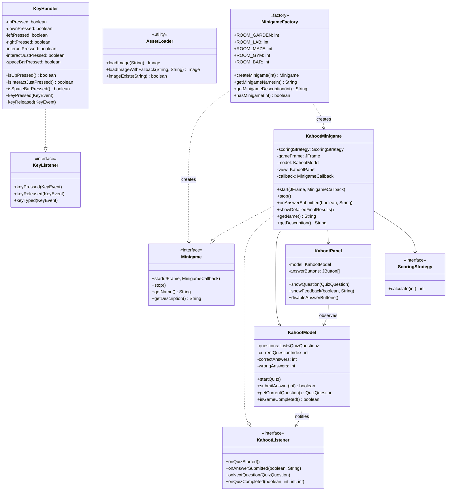

# University Escape

**Pozzati Mattia**, 
**Simone Brunelli**, 
**Altri**
**Data**: 12 giugno 2025

---

## Indice

1. [Analisi](#analisi)
    1. [Requisiti](#requisiti)
    2. [Analisi e modello del dominio](#analisi-e-modello-del-dominio)
2. [Design](#design)
    1. [Architettura](#architettura)
    2. [Design dettagliato](#design-dettagliato)
        1. [Pozzati Mattia](#pozzati-mattia)
        2. [Amantini Davide](#amantini-davide)
        3. [Brunelli Simone](#brunelli-simone)
3. [Sviluppo](#sviluppo)
    1. [Testing automatizzato](#testing-automatizzato)
    2. [Metodologia di lavoro](#metodologia-di-lavoro)
    3. [Note di sviluppo](#note-di-sviluppo)
4. [Commenti finali](#commenti-finali)
    1. [Autovalutazione e lavori futuri](#autovalutazione-e-lavori-futuri)
A. [Guida Utente](#guida-utente)

---

## 1. Analisi

### 1.1 Requisiti

Il progetto, commissionato dall’Università di Bologna, ha come obiettivo la realizzazione di un videogioco in stile escape room ambientato in un’università. Il gioco appartiene al genere puzzle/adventure e prevede la risoluzione di minigiochi per progredire tra le stanze.

**Requisiti funzionali:**
- Il gioco gestisce una partita composta da più stanze, ognuna con un minigioco diverso (Bar, Gym, Kahoot, ...).
- Presenza di un menu iniziale per avviare la partita, visualizzare la legenda dei tasti e uscire.
- Il giocatore può muoversi tra le stanze, interagire con oggetti e risolvere enigmi.
- Implementazione di collisioni tra entità e oggetti ambientali.
- Gestione delle condizioni di vittoria e sconfitta.

**Requisiti non funzionali:**
- Grafica coerente e pulita, ispirata allo stile pixel art.
- Interfaccia semplice e intuitiva.
- Ottimizzazione delle prestazioni e fluidità di gioco.

### 1.2 Analisi e modello del dominio

Il gioco è composto da una serie di stanze (room), ognuna con un minigioco specifico. Il giocatore deve risolvere i minigiochi per ottenere chiavi o oggetti necessari a progredire. Il dominio comprende entità come Player, Npc, Door, Room, Minigame.

**Obiettivo:**  
Raggiungere l’uscita finale dell’università risolvendo tutti i minigiochi e superando gli ostacoli.

---

## 2. Design

### 2.1 Architettura

La codebase adotta il pattern architetturale **MVC (Model-View-Controller)** per separare la logica di gioco, la gestione degli input e la visualizzazione grafica.

- **Model:** Gestisce la logica e i dati del gioco (stanze, entità, minigiochi, punteggi). Si trova in `src/main/java/it/unibo/exam/model/`.
- **View:** Si occupa della grafica e dell’interfaccia utente. Si trova in `src/main/java/it/unibo/exam/view/`.
- **Controller:** Media tra model e view, gestendo input e aggiornamenti. Si trova in `src/main/java/it/unibo/exam/controller/`.

Per la logica delle entità, è stato utilizzato il pattern **ECS (Entity-Component-System)**, che permette di comporre comportamenti tramite componenti riutilizzabili.

### 2.2 Design dettagliato

#### 2.2.1 Pozzati Mattia

**Gestione della creazione delle entità:**

Ho implementato il **Factory Pattern** per centralizzare la creazione delle entità di gioco (giocatore, NPC, oggetti interattivi). Questo approccio permette di gestire facilmente la complessità e la varietà delle entità, garantendo coerenza e riusabilità del codice. Le entità sono composte seguendo il paradigma ECS (Entity-Component-System). Le collisioni sono gestite tramite hitbox e metodi dedicati, assicurando un’interazione precisa tra le entità e l’ambiente. Queste sono le entità globali. In ogni minigioco sono presenti Entità caratteristiche sviluppate estendendo quelle globali.
**Minigioco stanza Gym "Bubble Shooter":**

Mi sono occupato della progettazione e dello sviluppo del minigioco della stanza Gym, ispirato al classico "Bubble Shooter". Ho realizzato sia la logica di gioco (model) che la gestione degli input e la visualizzazione grafica (controller e view).
- Model: Ho definito le classi per rappresentare i dischi (bubbles), il cannone e i proiettili, implementando la logica di movimento, collisione e rimozione dei dischi colpiti.
- Controller: Ho gestito gli input da tastiera e mouse per controllare il cannone e sparare i proiettili, integrando la logica di aggiornamento dello stato del gioco.
- View: Ho curato la visualizzazione grafica del minigioco, disegnando dinamicamente i dischi, il cannone e gli effetti di gioco, mantenendo uno stile coerente con il resto del progetto.

**Altre responsabilità:**
Ho contribuito all’implementazione delle classi relative all'accesso alle risorse del progetto.
Ho partecipato alla progettazione delle interfacce principali e alla definizione delle entità del dominio.

---

#### 2.2.2 Davide Amantini

**Gestione del Menu Principale e delle Opzioni**


Ho progettato e sviluppato la **GUI del menu principale** utilizzando Swing, seguendo le best practice dell’architettura **MVC** e tenendo conto della futura integrazione di minigiochi e opzioni di gioco.

- **Componenti principali**:
  - **MainMenuPanel**: pannello principale con i pulsanti “Gioca”, “Opzioni” e “Esci”, sfondo personalizzato e label esplicativa dei comandi principali (WASD, E, ESC).
  - **Integrazione responsive**: il layout è realizzato tramite GridBagLayout per adattarsi a qualsiasi dimensione finestra, e la grafica è caricata tramite l’utility `AssetLoader` per una gestione centralizzata delle risorse.

- **Gestione Eventi**:
  - Ogni bottone è associato a un’azione ben distinta tramite listener lambda, che comunica con il controller per avviare il gioco, mostrare il dialog delle opzioni, o uscire dal programma.
  - Il tasto **ESC** è intercettato tramite l’ActionMap/InputMap del pannello di gioco, permettendo di aprire un **menu di pausa** da cui si può tornare al menu principale o regolare le opzioni audio senza perdere lo stato corrente.

- **Gestione delle Opzioni (Audio/Musica)**:
  - La finestra **Opzioni** permette di modificare in tempo reale il volume della musica di sottofondo tramite uno **slider** (JSlider) e di attivare/disattivare l’audio generale tramite un pulsante mute.
  - Il **salvataggio delle preferenze** avviene in modo persistente usando le Preferences di Java (se necessario si può estendere con serialization o salvataggio file JSON/XML).

- **Comandi Principali**: sotto ai pulsanti del menu viene visualizzata una label HTML stilizzata che evidenzia i tasti di movimento e interazione, per una user experience chiara anche a nuovi giocatori.

**Minigioco CatchBall - Architettura e Sviluppo**


Ho progettato e realizzato il **minigioco CatchBall** (MVC pattern), ambientato nella stanza Garden, che simula la raccolta di gocce d’acqua con una borraccia.

- **Architettura MVC**:
  - **Model** (`CatchBallModel`): mantiene lo stato del gioco (posizione e vite, gestione palline, logica di vittoria/sconfitta, generazione random delle gocce).
  - **View** (`CatchBallPanel`): si occupa del rendering della scena, usando immagini custom per la bottiglia e le gocce. Il rendering è double-buffered e ottimizzato per evitare flicker.
  - **Controller** (`CatchBallMinigame`): gestisce input tastiera (A/D per movimento), timer per aggiornare la partita e sincronizza model e view; aggiorna la logica di punteggio con una strategia a decoratori (es. bonus tempo, cap massimo punti).

- **Gestione delle risorse**:
  - Tutte le immagini (sfondo, bottiglia, goccia) sono caricate centralmente con `AssetLoader` e ridimensionate dove necessario, garantendo efficienza e riuso.
  - Uso di fallback: se un’immagine non viene trovata, si passa automaticamente a un disegno placeholder.

- **Salvataggio delle Preferenze**:
  - Le preferenze audio e volume vengono lette/salvate ogni volta che si apre il dialog opzioni o il menu di pausa, usando `AudioManager` e, dove necessario, le Preferences di Java.

- **Comunicazione tra componenti**:
  - Il minigioco notifica il controller principale tramite callback (`MinigameCallback`), passando esito e punteggio. Questo permette di aggiornare la schermata HUD e i punteggi globali.

- **User Experience**:
  - Ogni aspetto grafico e di input è pensato per garantire immediatezza, chiarezza e coerenza con lo stile del resto del gioco (font, colori, trasparenze, icone, feedback visivi).
  - L’utente può sempre tornare al menu principale tramite ESC, senza rischiare di perdere i progressi o le impostazioni scelte.

**Altre Responsabilità e Contributi**

- Ho contribuito alla gestione centralizzata dell’audio di gioco (`AudioManager`).
- Ho collaborato nella definizione degli standard di stile (colori, font, layout) per assicurare coerenza visiva tra menu, minigiochi e HUD.
- Mi sono occupato della progettazione delle interfacce principali e della definizione delle principali entità di dominio.

---

#### 2.2.3 Simone Brunelli

## Panoramica

Questo documento dettaglia l'implementazione di quattro componenti sviluppati per il progetto UniversityEscape. Ogni classe dimostra diversi pattern architetturali e soluzioni tecniche, progettate con particolare attenzione alla robustezza, estensibilità e integrazione con il sistema complessivo.

---

## 🎯 1. KahootMinigame - Quiz Interattivo con Pattern MVC

### Approccio Progettuale

La classe `KahootMinigame` implementa il pattern MVC per separare chiaramente la logica, la presentazione e il controllo. L'implementazione si integra con il sistema di scoring esistente del team.

### Caratteristiche Principali

#### Integrazione con Sistema Scoring Esistente

```java
// Implementazione flessibile per integrazione con sistema scoring
public KahootMinigame(final ScoringStrategy scoringStrategy) {
    this.scoringStrategy = Objects.requireNonNull(scoringStrategy,
        "scoringStrategy must not be null");
}
```

#### Gestione Stati e Threading

Implementazione di un workflow per gestire il ciclo vita del quiz:

```java
// Gestione del threading per feedback non bloccante
new Thread(() -> {
    try {
        Thread.sleep(FEEDBACK_DELAY);
        javax.swing.SwingUtilities.invokeLater(() -> {
            if (model.isGameCompleted()) {
                showDetailedFinalResults();
            } else {
                showCurrentQuestion();
            }
        });
    } catch (final InterruptedException e) {
        Thread.currentThread().interrupt();
        javax.swing.SwingUtilities.invokeLater(this::showDetailedFinalResults);
    }
}).start();
```

#### Sistema Penalità Personalizzato

Aggiunge 10 secondi per ogni risposta sbagliata:

```java
public int getFinalTimeWithPenalty(final int penaltyPerWrongAnswer) {
    return getElapsedTimeSeconds() + (wrongAnswers * penaltyPerWrongAnswer);
}
```

#### Interfaccia Utente Dinamica

* Feedback colorato per risposte corrette/errate
* Aggiornamento real-time di progresso e statistiche
* Gestione graceful degli stati di transizione

---

## ⌨️ 2. KeyHandler - Sistema di Input

### Filosofia di Design

La classe `KeyHandler` fornisce un sistema di input che supporta sia azioni continue (movimento) che discrete (interazioni). L'implementazione risolve il problema classico del "key repeat" per le azioni singole.

### Innovazioni Tecniche

#### Pattern Auto-Reset per Azioni Singole

```java
// Soluzione al problema del key repeat
public boolean isInteractJustPressed() {
    if (interactJustPressed) {
        interactJustPressed = false; // Auto-reset immediato
        return true;
    }
    return false;
}

public boolean isSpaceBarPressed() {
    if (spaceBarPressed) {
        spaceBarPressed = false; // Reset dopo lettura
        return true;
    }
    return false;
}
```

#### Sistema Dual-Key Mapping

Supporto per tasti primari e alternativi per migliorare l'accessibilità:

```java
// Supporto sia WASD che frecce direzionali
if (code == KeyEvent.VK_W || code == KeyEvent.VK_UP) {
    upPressed = true;
}
if (code == KeyEvent.VK_A || code == KeyEvent.VK_LEFT) {
    leftPressed = true;
}
```

### Vantaggi Implementativi

* **Efficienza di Polling**: I controller leggono lo stato quando necessario
* **Coerenza dello Stato**: Prevenzione stati inconsistenti con auto-reset
* **Esperienza Utente**: Supporto sia WASD che frecce per inclusività
* **Precisione delle Azioni**: Distinzione netta tra azioni continue e discrete

---

## 🎨 3. AssetLoader - Gestione Risorse in Collaborazione

### Approccio Collaborativo

La classe `AssetLoader` è stata sviluppata in stretta collaborazione con un membro del team, combinando le competenze per creare una classe utility robusta per la gestione delle risorse. Insieme è stato progettato un sistema che enfatizza la robustezza e graceful degradation.

### Soluzioni Tecniche

#### Sistema Fallback Intelligente

```java
// Implementazione collaborativa del fallback automatico
public static Image loadImageWithFallback(final String resourcePath, final String fallbackPath) {
    Image image = loadImage(resourcePath);
    if (image == null && fallbackPath != null) {
        LOGGER.info("Attempting to load fallback image: " + fallbackPath);
        image = loadImage(fallbackPath);
    }
    return image;
}
```

#### Gestione Completa degli Errori

```java
// Approccio comprensivo all'error handling
try {
    final var resource = AssetLoader.class.getClassLoader().getResource(resourcePath);
    if (resource == null) {
        LOGGER.warning("Resource not found: " + resourcePath);
        return null;
    }
    
    final Image image = ImageIO.read(resource);
    if (image == null) {
        LOGGER.warning("Failed to read image from resource: " + resourcePath);
        return null;
    }
    
    LOGGER.info("Image loaded successfully: " + resourcePath);
    return image;
    
} catch (final IOException e) {
    LOGGER.log(Level.WARNING, "Failed to load image: " + resourcePath + " - " + e.getMessage(), e);
    return null;
} catch (final IllegalArgumentException e) {
    LOGGER.log(Level.WARNING, "Invalid image format: " + resourcePath + " - " + e.getMessage(), e);
    return null;
}
```

### Caratteristiche Collaborative

* **Validazione Risorse**: Controllo esistenza sviluppato congiuntamente
* **Logging Dettagliato**: Sistema di logging progettato insieme per debugging completo
* **Efficienza di Memoria**: Strategia di caricamento lazy definita in team

---

## 🏭 4. MinigameFactory - Implementazione del Factory Pattern

### Pattern di Design

La classe `MinigameFactory` implementa il Factory Pattern per centralizzare la creazione dei minigame e fornire un'interfaccia uniforme per il sistema.

### Architettura

#### Mapping Room-to-Minigame

```java
// Implementazione del mapping centralizzato
public static Minigame createMinigame(final int roomId) {
    switch (roomId) {
        case ROOM_GARDEN:
            return new CatchBallMinigame();
        case ROOM_LAB:
            return new KahootMinigame();
        case ROOM_MAZE:
            return new MazeMinigame();
        case ROOM_GYM:
            return new GymMinigame();
        case ROOM_BAR:
            return new BarMinigame();
        default:
            throw new IllegalArgumentException(
                "Invalid room ID for minigame: " + roomId
                + ". Valid room IDs are " + FIRST_ROOM + "–" + LAST_ROOM + "."
            );
    }
}
```

#### Metodi di Utilità

Metodi per evitare istanziazioni inutili:

```java
// Informazioni sui minigame senza istanziazione
public static String getMinigameName(final int roomId) {
    switch (roomId) {
        case ROOM_GARDEN: return "Catch the Ball";
        case ROOM_LAB: return "Kahoot";
        case ROOM_MAZE: return "Maze Runner";
        case ROOM_GYM: return "Bubble shooter";
        case ROOM_BAR: return "Sort & Serve";
        default: throw new IllegalArgumentException("Invalid room ID: " + roomId);
    }
}

public static boolean hasMinigame(final int roomId) {
    return roomId >= FIRST_ROOM && roomId <= LAST_ROOM;
}
```

### Vantaggi Architetturali

* **Creazione Centralizzata**: Unico punto per creazione minigame
* **Type Safety**: Validazione input con eccezioni descrittive
* **Estensibilità**: Facile aggiunta nuovi minigame
* **Accesso alle Informazioni**: Metadati senza istanziazione

---

## 📊 Diagramma UML delle Classi



---

## 🔧 Tecnologie e Pattern Utilizzati

* **Java Swing** per l'interfaccia utente
* **Pattern MVC** per separazione delle responsabilità
* **Factory Pattern** per creazione centralizzata
* **Observer Pattern** per notifiche eventi
* **Strategy Pattern** per sistemi di scoring flessibili
* **Thread Management** per operazioni non bloccanti

---

## 🚀 Caratteristiche Chiave

* **Robustezza**: Gestione completa degli errori con fallback intelligenti
* **Estensibilità**: Architettura modulare per facilità di espansione
* **Usabilità**: Interfacce intuitive con supporto accessibilità
* **Performance**: Gestione efficiente delle risorse e threading ottimizzato
* **Collaborazione**: Sviluppo in team con integrazione seamless

---

## 📝 Note sull'Implementazione

* Implementazione **MVC** con gestione threading avanzata per `KahootMinigame`
* Sistema **input** con auto-reset per azioni singole in `KeyHandler`
* Utility **robusta** sviluppata in collaborazione con fallback per `AssetLoader`
* **Factory** per creazione centralizzata minigame in `MinigameFactory`


---

#### 2.2.3 Daniel Alejandro Horna

**Gestione sistema di punteggi**

### 2.2.4 Simone Brunelli

**Gestione movimento player**

### 2.2.5 Tommaso Nori

**Gestione schermata finale e fine gioco**

*(Aggiungi qui le responsabilità e le soluzioni adottate dagli altri membri del gruppo, seguendo lo stile sopra)*

---

## 3. Sviluppo

### 3.1 Testing automatizzato

Abbiamo utilizzato **JUnit 5** per i test automatici.  
Esempi di test implementati:
- Test del timer di gioco.
- Test degli input da tastiera e mouse.
- Test delle collisioni tra entità.
- Test della logica dei minigiochi (Bar, Gym, Kahoot).

### 3.2 Metodologia di lavoro

Abbiamo lavorato utilizzando **Git** come DVCS, con repository condiviso.  
La suddivisione del lavoro è stata equa, con interfacce principali progettate insieme e sviluppo parallelo delle varie componenti.  
Le modifiche sono state integrate tramite e code review.

### 3.3 Note di sviluppo

- Uso estensivo di **Optional** e **Stream API** per una gestione funzionale dei dati.
- Utilizzo di pattern come **Factory**, **Component**, **Template Method** per una maggiore modularità.
- Attenzione particolare alla separazione delle responsabilità e alla manutenibilità del codice.
- Risoluzione sistematica di warning statici (SpotBugs, Checkstyle, PMD).
- Gestione input e focus per garantire la responsività dei minigiochi.
- Implementazione di strategie di scoring modulari e riutilizzabili.

---

## 4. Commenti finali

### 4.1 Autovalutazione e lavori futuri

**Pozzati Mattia:**  
All’inizio il progetto è stato impegnativo, ma lavorando in gruppo e suddividendo le responsabilità sono riuscito a migliorare sia tecnicamente che come membro di un team. In futuro vorrei approfondire la gestione di animazioni e l’ottimizzazione delle performance.

**[Altri membri]:**  
*(Aggiungi qui le autovalutazioni degli altri membri, seguendo lo stile sopra)*

---

## A. Guida Utente

**Obiettivo:**  
Raggiungere l’uscita dell’università risolvendo tutti i minigiochi.

**Comandi di gioco:**
- **ESC:** Pausa
- **W / ↑:** Muovi verso l’alto
- **A / ←:** Muovi a sinistra
- **S / ↓:** Muovi verso il basso
- **D / →:** Muovi a destra
- **E:** Interagisci

---

## Bibliografia

- [Fesliyan Studios - Musiche di gioco]()
- [Sprite e risorse grafiche](https://www.spriters-resource.com/)
- [Ispirazione e tutorial](https://www.youtube.com/@RyiSnow)

---
