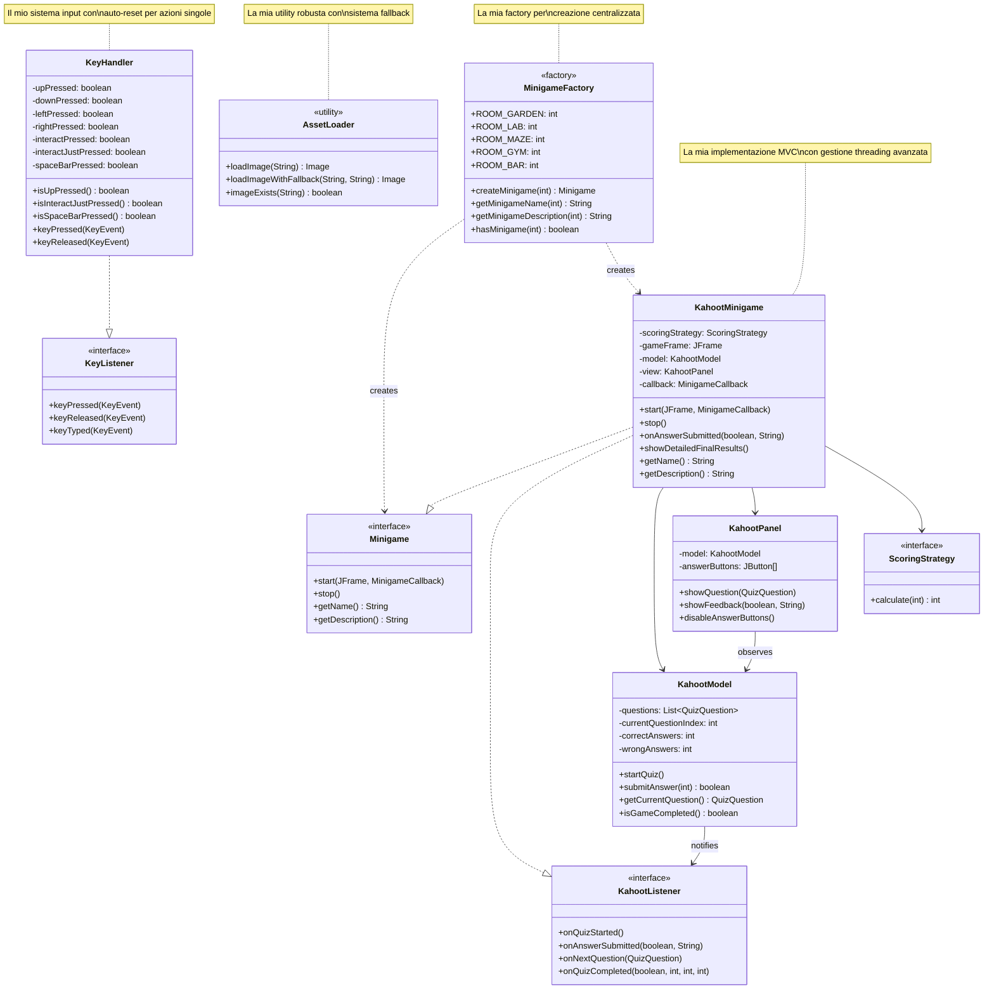

**Simone Brunelli**

**KahootMinigame, KeyHandler, AssetLoader e MinigameFactory**

## Panoramica del Mio Contributo

Durante lo sviluppo del progetto UniversityEscape, mi sono occupato dell'implementazione di quattro componenti che dimostrano diversi pattern architetturali e soluzioni tecniche. Ogni classe è stata progettata con particolare attenzione alla robustezza, estensibilità e integrazione con il sistema complessivo.

---

## 1. KahootMinigame - La Mia Implementazione del Quiz Interattivo

### Il Mio Approccio Progettuale

Ho progettato `KahootMinigame` come un sistema complesso che implementa il pattern MVC per separare chiaramente la logica di business, la presentazione e il controllo del flusso. La mia implementazione si integra con il sistema di scoring esistente del team.

### Le Mie Scelte Architetturali

#### Integrazione con Sistema Scoring Esistente
```java
// La mia implementazione utilizza il sistema di scoring del team
public KahootMinigame(final ScoringStrategy scoringStrategy) {
    this.scoringStrategy = Objects.requireNonNull(scoringStrategy,
        "scoringStrategy must not be null");
}
```

Ho progettato la mia classe per essere flessibile e accettare qualsiasi strategia di scoring, integrandomi perfettamente con l'architettura esistente del team.

#### Il Mio Sistema di Stati e Threading
Ho implementato un workflow complesso per gestire il ciclo vita del quiz:

```java
// La mia gestione del threading per feedback non bloccante
new Thread(() -> {
    try {
        Thread.sleep(FEEDBACK_DELAY);
        javax.swing.SwingUtilities.invokeLater(() -> {
            if (model.isGameCompleted()) {
                showDetailedFinalResults();
            } else {
                showCurrentQuestion();
            }
        });
    } catch (final InterruptedException e) {
        Thread.currentThread().interrupt();
        javax.swing.SwingUtilities.invokeLater(this::showDetailedFinalResults);
    }
}).start();
```

### Le Mie Innovazioni nel Quiz Management

#### Sistema Penalità Personalizzato
Ho implementato un sistema di penalità che aggiunge 10 secondi per ogni risposta sbagliata:
```java
public int getFinalTimeWithPenalty(final int penaltyPerWrongAnswer) {
    return getElapsedTimeSeconds() + (wrongAnswers * penaltyPerWrongAnswer);
}
```

#### Interfaccia Utente Dinamica
La mia implementazione del pannello quiz include:
- Feedback colorato per risposte corrette/errate
- Aggiornamento real-time di progresso e statistiche
- Gestione graceful degli stati di transizione

---

## 2. KeyHandler - Il Mio Sistema di Input

### La Mia Filosofia di Design

Ho sviluppato `KeyHandler` con l'obiettivo di fornire un sistema di input che supportasse sia azioni continue (movimento) che discrete (interazioni). La mia implementazione risolve il problema classico del "key repeat" per le azioni singole.

### Le Mie Innovazioni Tecniche

#### Pattern Auto-Reset per Azioni Singole
```java
// La mia soluzione al problema del key repeat
public boolean isInteractJustPressed() {
    if (interactJustPressed) {
        interactJustPressed = false; // Auto-reset immediato
        return true;
    }
    return false;
}

public boolean isSpaceBarPressed() {
    if (spaceBarPressed) {
        spaceBarPressed = false; // Reset dopo lettura
        return true;
    }
    return false;
}
```

#### Il Mio Dual-Key Mapping System
Ho implementato il supporto per tasti primari e alternativi per migliorare l'accessibilità:
```java
// Supporto sia WASD che frecce direzionali
if (code == KeyEvent.VK_W || code == KeyEvent.VK_UP) {
    upPressed = true;
}
if (code == KeyEvent.VK_A || code == KeyEvent.VK_LEFT) {
    leftPressed = true;
}
```

### I Miei Vantaggi Implementativi
- **Polling Efficiency**: I controller leggono lo stato quando necessario
- **State Consistency**: Prevenzione stati inconsistenti con auto-reset
- **User Experience**: Supporto sia WASD che frecce per inclusività
- **Action Precision**: Distinzione netta tra azioni continue e discrete

---

## 3. AssetLoader - Resource Management

### Il Mio Approccio alla Robustezza

Ho progettato `AssetLoader` come una classe utility che gestisce il caricamento risorse con enfasi sulla robustezza e graceful degradation. La mia implementazione prevede sempre un piano B.

### Le Mie Soluzioni Tecniche

#### Sistema Fallback Intelligente
```java
// La mia implementazione del fallback automatico
public static Image loadImageWithFallback(final String resourcePath, final String fallbackPath) {
    Image image = loadImage(resourcePath);
    if (image == null && fallbackPath != null) {
        LOGGER.info("Attempting to load fallback image: " + fallbackPath);
        image = loadImage(fallbackPath);
    }
    return image;
}
```

#### La Mia Gestione Completa degli Errori
```java
// Il mio approccio comprensivo all'error handling
try {
    final var resource = AssetLoader.class.getClassLoader().getResource(resourcePath);
    if (resource == null) {
        LOGGER.warning("Resource not found: " + resourcePath);
        return null;
    }
    
    final Image image = ImageIO.read(resource);
    if (image == null) {
        LOGGER.warning("Failed to read image from resource: " + resourcePath);
        return null;
    }
    
    LOGGER.info("Image loaded successfully: " + resourcePath);
    return image;
    
} catch (final IOException e) {
    LOGGER.log(Level.WARNING, "Failed to load image: " + resourcePath + " - " + e.getMessage(), e);
    return null;
} catch (final IllegalArgumentException e) {
    LOGGER.log(Level.WARNING, "Invalid image format: " + resourcePath + " - " + e.getMessage(), e);
    return null;
}
```

### Le Mie Features Aggiuntive
- **Resource Validation**: Controllo esistenza senza caricamento
- **Detailed Logging**: Informazioni complete per debugging
- **Memory Efficiency**: Caricamento lazy, no pre-loading inutile

---

## 4. MinigameFactory - La Mia Implementazione del Factory Pattern

### Il Mio Design Pattern Factory

Ho implementato `MinigameFactory` seguendo il Factory Pattern per centralizzare la creazione dei minigame e fornire un'interfaccia uniforme per il sistema.

### La Mia Architettura

#### Mapping Room-to-Minigame
```java
// La mia implementazione del mapping centralizzato
public static Minigame createMinigame(final int roomId) {
    switch (roomId) {
        case ROOM_GARDEN:
            return new CatchBallMinigame();
        case ROOM_LAB:
            return new KahootMinigame();
        case ROOM_MAZE:
            return new MazeMinigame();
        case ROOM_GYM:
            return new GymMinigame();
        case ROOM_BAR:
            return new BarMinigame();
        default:
            throw new IllegalArgumentException(
                "Invalid room ID for minigame: " + roomId
                + ". Valid room IDs are " + FIRST_ROOM + "–" + LAST_ROOM + "."
            );
    }
}
```

#### Le Mie Utility Methods
Ho aggiunto metodi di utilità per evitare istanziazioni inutili:
```java
// Informazioni sui minigame senza istanziazione
public static String getMinigameName(final int roomId) {
    switch (roomId) {
        case ROOM_GARDEN: return "Catch the Ball";
        case ROOM_LAB: return "Kahoot";
        case ROOM_MAZE: return "Maze Runner";
        case ROOM_GYM: return "Bubble shooter";
        case ROOM_BAR: return "Sort & Serve";
        default: throw new IllegalArgumentException("Invalid room ID: " + roomId);
    }
}

public static boolean hasMinigame(final int roomId) {
    return roomId >= FIRST_ROOM && roomId <= LAST_ROOM;
}
```

### I Miei Vantaggi Architetturali
- **Centralized Creation**: Unico punto per creazione minigame
- **Type Safety**: Validazione input con eccezioni descrittive
- **Extensibility**: Facile aggiunta nuovi minigame
- **Information Access**: Metadati senza istanziazione

---

## Schema UML delle Mie Implementazioni



---

## Le Mie Scelte Tecniche e Motivazioni

### Integrazione e Collaborazione
Le mie implementazioni sono state progettate per integrarsi perfettamente con il lavoro del team:
- **KahootMinigame** utilizza il sistema di scoring comune
- **KeyHandler** fornisce input standardizzato per tutti i componenti
- **AssetLoader** è utilizzato da tutti i minigame per le risorse
- **MinigameFactory** centralizza la creazione per il MainController

### Robustezza e Manutenibilità
Ogni mia implementazione include:
- **Error Handling Completo**: Gestione di tutti i casi edge
- **Logging Dettagliato**: Supporto completo per debugging
- **Graceful Degradation**: Funzionamento anche in condizioni subottimali
- **Extensibility**: Facilità di modifica e estensione

### Performance e UX
Le mie scelte sono state orientate a:
- **Responsiveness**: UI sempre responsiva (threading appropriato)
- **Efficiency**: Algoritmi e pattern ottimizzati
- **User Experience**: Controlli intuitivi e feedback immediato
- **Accessibility**: Supporto per diversi stili di input

---

## Conclusioni del Mio Lavoro

Le quattro componenti che ho implementato dimostrano la mia comprensione di:

- **Design Patterns**: Factory, MVC, Observer per architetture pulite
- **Threading**: Gestione appropriata di UI e background tasks
- **Error Handling**: Approccio difensivo con graceful degradation
- **Integration**: Capacità di lavorare in team e integrarsi con codice esistente

Ogni implementazione riflette la mia attenzione ai dettagli, focus sulla qualità del codice e comprensione delle best practices Java. Il risultato è un set di componenti robusti, efficienti e facilmente manutenibili che contribuiscono significativamente all'architettura complessiva del progetto.